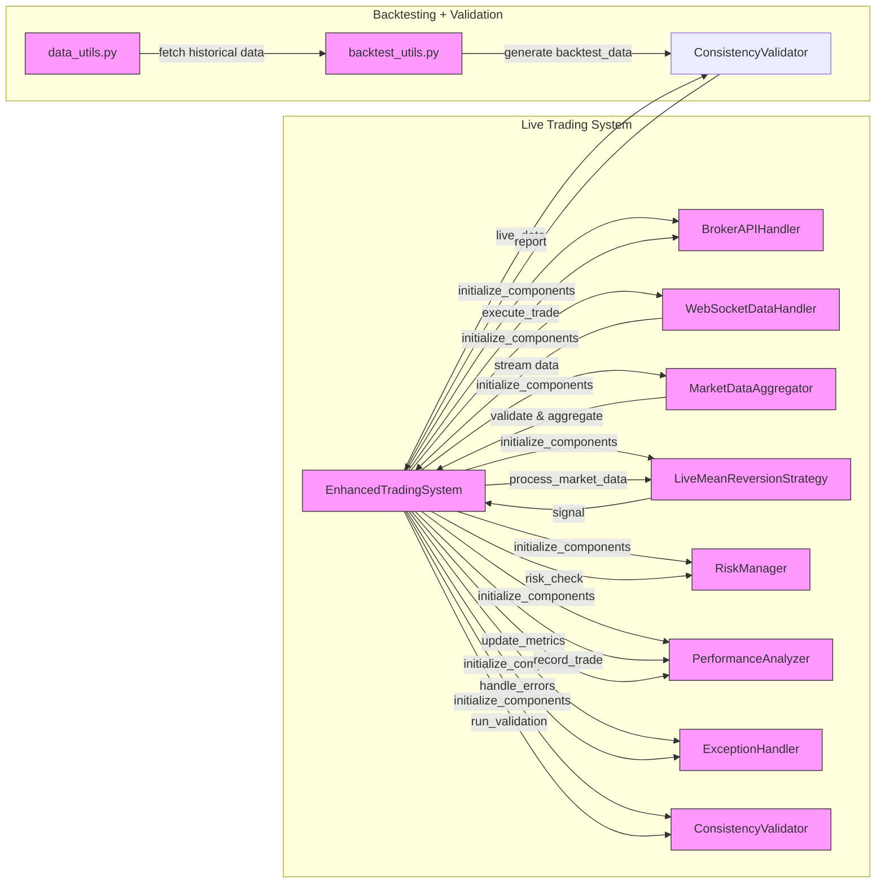

# Python Algorithmic Trading Framework

This project is a Python-based framework designed to help you build, test, and run algorithmic trading strategies. It provides tools for handling market data, managing risks, analyzing performance, and connecting to a (paper) trading account, primarily using the Alpaca API.

## What Can You Do With This?

* **Develop Trading Strategies:** Create your own automated trading rules. Examples included:

  * EMA Crossover (Trend Following)

  * Z-Score Mean Reversion

* Custom Ratio Strategy

* **Back-test Strategies:** Test your strategies on historical market data to see how they would have performed.

* **Optimize Parameters:** Find the best settings for your strategy's indicators.

* **Live/Paper Trading:** Connect to Alpaca (a brokerage API) to run your strategies with real-time data (using a paper trading account is highly recommended for testing).

* **Manage Data:** Fetch historical data, add technical indicators (like Moving Averages, ADX), and even apply data smoothing techniques (like Kalman Filter).

* **Control Risk:** Implement basic risk management rules.

* **Analyze Performance:** Get detailed reports on how well your strategies are doing (e.g., profits, losses, Sharpe Ratio, Drawdown).

* **Handle Errors:** The system has built-in error handling to make it more robust.

* **Check Consistency:** Compare how your strategy performs in back-testing versus live (paper) trading.

## Key Features

* **Strategy Library:** Includes several common trading strategy types.

* **Backtesting Engine:** Uses the popular `backtrader` library.

* **Alpaca API Integration:** For fetching data, placing orders, and managing your (paper) account.

* **Real-time Data:** Uses WebSockets to get live market data from Alpaca.

* **Data Processing:** Tools to clean, resample, and add technical indicators to data.

* **Risk Management Module:** Basic tools to assess and manage trading risks.

* **Performance Analytics:** Detailed metrics and charts to evaluate strategy performance.

* **Robust Error Handling:** Mechanisms to catch and manage common trading system errors.

## Core Modules (What Each File Does)

* `main.py`: The main script to run back-tests and strategy optimizations.

* `strategies.py`: Contains the definitions for different trading strategies (e.g., EMA Crossover, Z-Score).

* `data_utils.py`: Functions for fetching, caching, and processing market data (e.g., adding indicators).

* `backtest_utils.py`: Helper functions to analyze the results from back-testing.

* `broker_handler.py`: Manages communication with the Alpaca trading API (placing orders, getting account info).

* `live_trader.py`: Contains the logic for running strategies in a live (paper) trading environment.

* `websocket_handler.py`: Handles real-time market data streams from Alpaca via WebSockets.

* `risk_manager.py`: Implements risk management rules and calculations (like VaR).

* `performance_analyzer.py`: Calculates and reports on trading performance metrics.

* `exception_handler.py`: Provides a system for managing errors and exceptions gracefully.

* `consistency_validator.py`: Tools to compare back-test results with live trading performance.

* `test_broker_api.py`: Script to test the connection and basic functions of the Alpaca API.

## Setup

1. **Prerequisites:**

    * Python (version 3.10 or as specified in `environment.yml`)

    * Conda (recommended for managing environments)

2. **Clone the Repository:**

    ```bash
    git clone <your-repository-url>
    cd <your-repository-folder>
    ```

3. **Create Conda Environment:**

    ```bash
    conda env create -f environment.yml
    conda activate cqf-algo-trading
    ```

4. **API Keys (Alpaca):**

    * You'll need API keys from Alpaca (you can get these for free for paper trading).

    * Create a file named `.env` in the root project directory.

    * Add your Alpaca API keys to this `.env` file like this:

        ```text
        APCA_API_KEY_ID="YOUR_PAPER_API_KEY_ID"
        APCA_API_SECRET_KEY="YOUR_PAPER_API_SECRET_KEY"
        ALPACA_BASE_URL="https://paper-api.alpaca.markets" # For paper trading
        ```

    * **Important:** Make sure the `.env` file is listed in your `.gitignore` file to avoid accidentally committing your secret keys!

## How to Run

* **Run Back-tests & Optimizations:**

    ```bash
    python main.py
    ```

    This will run the predefined backtests and optimizations found in `main.py`. You can modify this file to test different strategies or parameters.

* **Run Live (Paper) Trader:**

    ```bash
    python live_trader.py
    ```

    This will start the live trading bot. It's set up for **paper trading** by default.
    **WARNING:** Be very careful if you decide to switch to live money trading. Understand the risks involved.

* **Test Alpaca API Connection:**

    ```bash
    python test_broker_api.py
    ```

    This script helps verify that your Alpaca API keys are working and you can connect to their services.

## Technologies Used

* Python

* Backtrader (for backtesting)

* Pandas, NumPy (for data manipulation)

* Alpaca Trade API (for brokerage interaction)

* Pandas TA (for technical indicators)

* Websockets (for real-time data)

* Matplotlib, Seaborn (for plotting)

## Disclaimer

This project is for educational and research purposes only. Trading financial markets involves substantial risk of loss and is not suitable for every investor. The authors and contributors are not responsible for any financial losses incurred by using this software. Always use paper trading accounts for testing and understand the risks before trading with real money.



---

Task requirement for reference:

## Algorithmic Trading for Reversion and Trend-Following Overview

Algorithmic trading in HFT space is concerned with how to optimally run the core strategies focusing on execution. The issues of order types as allowed by broker/exchange, slippage, and algorithm ability to manage risk come before the mathematical and statistical nuances of strategy. However, this is a quantitative study project. Therefore, with attention to math and application detail (e.g., sample period/time window experiment) implement at least two kinds of strategy: (a) a trend-following strategy with several indicators of your choice AND (b) reversion strategy with an indicator of your choice. Part I. That you can do as a historic back-test but encouraged to use data of higher frequencies, rather than daily (e.g., 15 Min).

In Parts II and III extend the strategies from back-testing to some degree of live-testing to test simple scripts with Broker API of your choice. However, if specific Broker API/language learning curve is steep, you can limit the scope – Part II covers more detail. Real-time trading relies on loops which check for buy/sell signal, and to improve the performance more optimized languages than Python are used in the industry, e.g. GoLang. A. The trading code must handle exceptions: failures during the order execution and inconsistent/incorrect information received back from the broker (e.g., order filled when it wasn't, mismatch in order type). B. Trading overall should consider liquidity, market impact, and sudden market events – though you are not likely to be in position to affect the market but consider,

1. changes in price and volume (market impact, liquidity regime);

2. order-specific events, subject to information about execution from API.

## Trend-Following Strategy

Trend-following strategies aim to capitalize on sustained movements in the market. The indicators such as the **Moving Averages**, **Exponential Moving Averages (EMA)** and **Average Directional Index (ADX)** to confirm trends. The ADX measures the strength of a trend, helping to filter out weak trends that may not be profitable. You can combine moving averages with ADX, in order to generate better quality trading signals.

Experiment with resampling interval and averaging period to assess the effectiveness of your specific trend-following approach. Discuss or better backtest the impact of various market-specific events/liquidity conditions/regime in asset price.

## Part I: Generic Strategies Made Proprietary

Write code that implements testing on your core strategies, that can be done Python and on historical data (back-testing). Understanding mathematical nuance of indicator, and its back-testing has different purposes, as compared to live-testing which would focus on order slippage, for example. Here, you are not limited to Python, and can use a specialized language + Broker API for Part I as well. There are **Backtrader**, **Zipline**, **PyAlgoTrade** packages but Python doesn't have a ready one solution for our Part I purposes.

1. For a core trend-following strategy kind, common choices are **Exponential Moving Average (EMA)** and **Average Directional Index (ADX)**, which is a kind of oscillator. Other approach is a convergence/divergence indicator, **Moving Average Convergence/Divergence (MACD)**. For each strategy, you need to decide on: your own indicator, how it is computed, and what constitutes a trading signal (e.g., crossover of 20D EMA with another).

2. Simple but practical trend indicator primarily used in FX is of the following design:

    - **Step 1:** resample the prices at regular intervals (e.g., 30 seconds) for price level or average; Can use `DataFrame.resample`;

    - **Step 2:** calculate an average price over the longer period (e.g., 5-minute intervals).

    - **Step 3:** compute the ratio of short-term price (or its average) to long-term average price. Ratio close to 1 signals 'no trend' as short-term prices ≈ the long-term prices. Uptrend is signaled by the ratio above 1, and downtrend by less than 1. Implement trading logic to open a position when market prices deviate from that average, and close when prices revert: how large/small the ratio should be before it's a considered buy/sell signal is your experiment and design.

3. Present full mathematical description of the trend-following indicators chosen. Experiment with the ratios, adjust the time period and provide the summary of that analysis.

4. For a mean-reversion strategy kind,

    - Z\* deviation from the price can be used as a simple signal. Or think about distance measures from machine learning.

    - Formal modeling of mean-reversion with OU process can be invoked expecting the price to mean-revert over short-time.

    - **OPTIONAL** To generate a stable P&L from reversion strats, very likely that Kalman/unscented filtering needs to be applied to the price (see Topic TS).

5. Discussion. Consider the regime implications: for example, would the upward trend with more jumps and volatility (over the period) produce worse or better returns for the specific indicator/strategy?

## Part II: Broker API

1. The common API choice is **REST** (Representational State Transfer).

    - **Alpaca**, **Interactive Brokers Web**, and **Oanda** all have their own versions. In particular, **Alpaca** REST API is free and includes asynchronous events handling based on **WebSocket** and **Server Side Events (SSE)**.

    - **REST API** is referred to as **HTTP API** because it utilizes HTTP methods, eg **GET** (retrieve data), **POST** (create new data), **PUT** (update data). Useable for non-time-critical operations such as retrieving historical data, account information, placing orders, and getting order status.

2. The more industrial strength and lower latency API choice is **FIX** (Financial Information eXchange). A messaging protocol designed for the **real-time** exchange of securities transactions. It supports submission and cancellation of various order types, trade execution reports, and market data dissemination – all for high frequency. FIX is used by large institutions, funds, and broker/dealers.

3. **Interactive Brokers** offer **TWS API** with connection to their client application and possibility to use **C++**, **C#**, **Java**, **Python**. Useful comparison of these API but not an endorsement is available at [www.interactivebrokers.com/en/index.php?f=5041](https://www.interactivebrokers.com/en/index.php?f=5041).

4. Treat this project as more professional in regard to the trading, e.g., instead of **Yahoo!Finance**, fetch your data from **OpenBB/brokerage** and think of data quality.

Describe order types suitable to your traded assets, and attempt code for handling orders using the API. Set price parameters far from the market to avoid execution. It is an absolute recommendation though that you use a paper trading account.

## Part III: Evaluate Risk and Test Thrice

An opened market position is exposed to various types of risk. While the market risk can be managed using simple quant methods like rolling **VaR**, order handling risk is more important and should be addressed in Part II.

1. **Event Handling.** Code must have verification mechanisms for server responses. On the broker side and for whichever reason, orders may be cancelled, partially filled or even returned with an incorrect fill information.

2. **Positions Tracking.** Code can request account updates (e.g., in loop) to provide a secondary confirmation layer.

3. **Market Data.** Introduce simple checks to catch inconsistencies in market data, received from the broker. Which checks will depend on the asset and application, for example, futures price can't be below spot price or lead to a negative implied quantity.

4. **Performance and Risk Reporting.** Please realize that Portfolio/Statistical Arb systematic back-testing scorecards, **Pyfolio** are of less utility in algo trading (e.g., concentration in asset, **Beta-to-SPY**). However, certain performance ratios, turnover/costs information, **Drawdowns** and rolling **VaR** can be adapted. Provide examples of this (end of Part II or end of report).

The general principle is to preserve the trading capital as much as possible.
