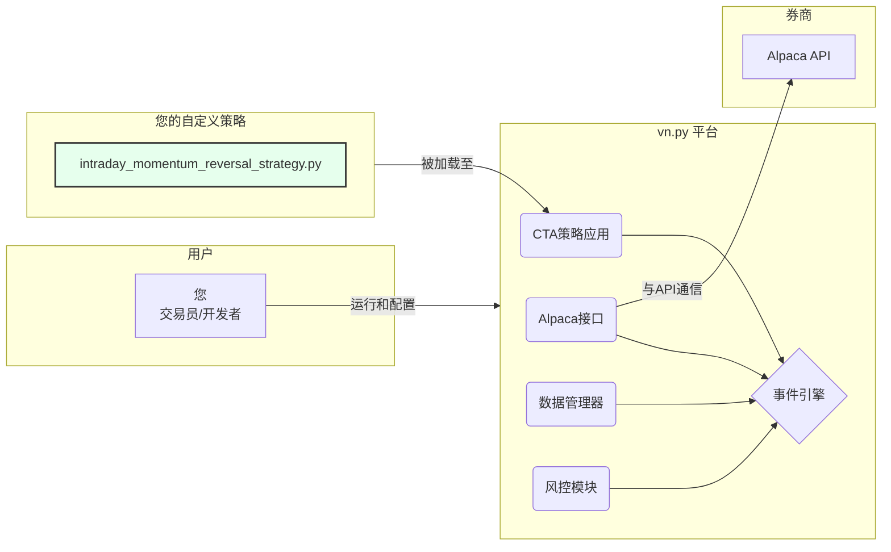

# VN.py 量化交易框架

这是一个基于知名开源项目 [VN.py](https://www.vnpy.com) 构建的量化交易框架，旨在提供一套完整的策略开发、历史回测及实盘交易解决方案。

## 为何选择 vn.py？

该项目基于 vn.py 平台构建，具备以下核心优势：

*   **生产级别的稳定性**：vn.py 拥有成熟且经过业界检验的事件驱动引擎，能够确保实盘交易环境的稳定可靠。
*   **统一的交易接口**：通过统一的网关接口，可以无缝接入多家国内外券商及交易平台（例如，本项目中用于模拟和实盘交易的 Alpaca 平台）。
*   **一体化的工具套件**：vn.py 提供“全家桶”式的解决方案，内置了回测、风控、数据管理和图形用户界面（GUI）等核心功能模块。
*   **专注于策略研发**：框架处理了所有底层技术细节，例如 WebSocket 连接、订单管理和各家 API 的特性差异，让开发者可以心无旁骛地专注于策略逻辑的开发。

## 关于“CTA策略”模块的特别说明

您可能会注意到，vn.py 将其主要的单资产策略模块称为 **CTA 策略**。

尽管“CTA”（Commodity Trading Advisor，商品交易顾问）一词在历史上与期货交易紧密相关，但在 vn.py 的体系中，该模块是一个通用引擎。它适用于任何基于连续时间序列数据（K线）的算法策略。因此，使用 CTA 策略模块来开发**股票**、期货或加密货币的量化策略，都是标准且正确的选择。

您可以简单地将“CTA策略”理解为：**“基于K线（Bar）的单标的算法策略”**。

## 核心策略实现: `IntradayMomentumReversalStrategy`

本框架实现了一个日内动量反转策略，该策略严格不持有隔夜仓位。

*   **技术指标**: RSI(6) + KDJ(9,3,3)
*   **交易标的**: 支持TQQQ、SPY等任意标的
*   **时间框架**: 1分钟K线数据
*   **日内交易**: 严格不持有隔夜仓位

### 交易逻辑

**做空信号 (超买反转):**

*   **监控条件**: `RSI > 80` 且 `KDJ J > 100`
*   **入场信号**: RSI值开始下降 或 KDJ J值开始下降
*   **仓位分配**:
    *   价格 ≥ 开盘价，分配10%资金
    *   价格 < 开盘价，分配30%资金
*   **平仓条件**: `RSI < 20` 或 `KDJ J < 0`

**做多信号 (超卖反转):**

*   **监控条件**: `RSI < 20` 且 `KDJ J < 0`
*   **入场信号**: RSI值开始上升 或 KDJ J值开始上升
*   **仓位分配**:
    *   价格 ≥ 开盘价，分配30%资金
    *   价格 < 开盘价，分配10%资金
*   **平仓条件**: `RSI > 80` 或 `KDJ J > 100`

## 平台架构

本项目在 vn.py 生态中作为插件运行。所有核心的、繁重的工作都由 vn.py 的内部组件处理。



## 环境配置与安装

1.  **环境要求**:
    *   Python (3.10或更高版本)
    *   Conda (强烈推荐，用于管理Python环境)

2.  **克隆本代码库**:

    ```bash
    git clone https://github.com/runchengxie/vnpy-trading-framework.git
    cd vnpy-trading-framework
    ```

3.  **创建虚拟环境**:

    ```bash
    # 创建并激活 conda 虚拟环境
    conda create -n vnpy_trading python=3.10 -y
    conda activate vnpy_trading
    ```

4.  **安装依赖**:
    本项目使用 `pyproject.toml` 管理依赖。您可以通过一个命令安装框架及其所有依赖。可编辑模式 (`-e`) 非常适合开发。

    ```bash
    # 以可编辑模式安装本项目
    pip install -e .
    ```
    该命令会自动读取 `pyproject.toml` 文件，安装 `vn.py`、所有必需的网关（包括从GitHub指定版本的 `vnpy-alpaca`）以及其他库。同时，它会自动将 `strategies` 目录注册为一个可导入的包，**无需手动复制任何策略文件**。

5.  **配置 API 密钥 (Alpaca)**:
    `vn.py` 通过一个中心的JSON文件来管理配置，而非 `.env` 文件。
    *   首次运行 `vnstation` 后，系统会自动在用户目录下生成默认的配置文件。
    *   打开该配置文件。在 Windows 系统中，路径通常是 `C:\Users\YourUser\.vntrader\vt_setting.json`；在 Linux 或 macOS 系统中，路径是 `~/.vntrader/vt_setting.json`。
    *   找到 `Alpaca` 相关的配置部分，填入您的 API 密钥：

    ```json
    {
        "Alpaca.key": "您的模拟盘API Key",
        "Alpaca.secret": "您的模拟盘API Secret",
        "Alpaca.server": "PAPER"
    }
    ```

    **重要提示**：为安全起见，在测试阶段请确保 `Alpaca.server` 指向的是 Alpaca 的**模拟盘**（PAPER）交易服务器。

## 如何运行

### 1. 下载历史数据

在回测之前，您需要准备历史数据。使用项目提供的脚本来下载：

```bash
# 从雅虎财经下载SPY最近一年的日线数据
python scripts/download_data.py --symbol SPY --days 365 --source yahoo --interval 1d

# 下载AAPL在特定日期范围内的1分钟数据
python scripts/download_data.py --symbol AAPL --start 2023-01-01 --end 2023-12-31 --interval 1m

# 查看本地数据库中已有数据的概览
python scripts/download_data.py --overview
```

### 2. 策略回测

执行回测最可靠的方式是通过 `VN Station` 图形化界面。

1.  **启动图形化界面**:
    在您的终端（已激活 `vnpy_trading` 环境），运行：
    ```bash
    vnstation
    ```

2.  **加载模块**:
    在主窗口中，点击加载 **CTA策略** 模块。

3.  **连接Alpaca**:
    点击菜单栏的 `系统` -> `连接`，然后选择 `Alpaca`。系统将使用您在 `vt_setting.json` 中配置的密钥进行连接。

4.  **进入CTA回测**:
    切换到 **CTA回测** 界面。

5.  **配置并运行回测**:
    *   **策略**: 从下拉列表中选择 `IntradayMomentumReversalStrategy`。
    *   **代码**: 输入回测用的合约代码，例如 `AAPL.NASDAQ`。
    *   **参数**: 设置策略参数，如 `rsi_period`, `kdj_period` 等。
    *   **回测设置**: 设置回测的起止日期、初始资金、手续费率和滑点。
    *   点击 **【开始回测】** 按钮。

6.  平台将自动完成回测，并生成详细的业绩统计和图表。

### 3. 实盘（模拟）交易

1.  同样地，启动 **VN Station** 并加载 **CTA策略** 模块。

2.  **进入CTA交易**:
    切换到 **CTA交易** 界面。

3.  **添加策略实例**:
    *   在左侧的策略管理面板，点击 **【添加策略】**。
    *   在弹出的窗口中，选择您的策略类 `IntradayMomentumReversalStrategy`。
    *   为该实例指定一个唯一的名称（例如 `IMR_AAPL`）。
    *   配置好交易参数和合约代码（例如 `AAPL.NASDAQ`）。

4.  **启动策略**:
    *   新的策略实例会出现在列表中。选中它。
    *   依次点击 **【初始化】** 和 **【启动】** 按钮。

5.  策略启动后，您可以在图形化界面的日志、委托、成交和持仓等窗口中实时监控策略的运行状态。

### 关于辅助脚本的说明

请注意，`scripts/` 目录下的部分脚本（如 `run_backtest.py`, `run_live_trading.py`, `quick_start.py`）已经**过时**，它们引用了旧的、已不存在的策略名称。**这些脚本未经修改将无法直接运行**。保留它们是为了展示如何实现自动化工作流的参考。若要使用，您需要手动修改其中的策略类名和参数，以匹配 `IntradayMomentumReversalStrategy`。

## 项目文件结构

```
.
├── config/
│   ├── backtest_config.json        # 回测配置文件 (已过时)
│   ├── download_config.json        # 数据下载脚本的配置文件
│   └── live_trading_config.json    # 实盘交易配置文件 (已过时)
├── scripts/
│   ├── download_data.py            # 功能完备的历史数据下载工具
│   ├── install.py                  # 安装脚本 (已废弃, 请使用 'pip install -e .')
│   ├── quick_start.py              # 快速入门演示 (需更新)
│   ├── run_backtest.py             # 回测脚本 (需更新)
│   ├── run_live_trading.py         # 实盘运行脚本 (需更新)
│   └── test_framework.py           # 框架测试脚本 (需更新)
├── strategies/
│   └── intraday_momentum_reversal_strategy.py  # 日内动量反转策略
├── .gitignore
├── LICENSE.txt
├── pyproject.toml                  # 项目定义与依赖管理文件
└── README.md                       # 本文件
```

## 免责声明

本项目仅用于教育和研究目的。金融市场交易存在重大亏损风险，不适合所有投资者。对于使用本软件可能造成的任何财务损失，项目作者及贡献者不承担任何责任。在投入真实资金前，请务必使用模拟账户进行充分测试，并完全理解所有相关风险。