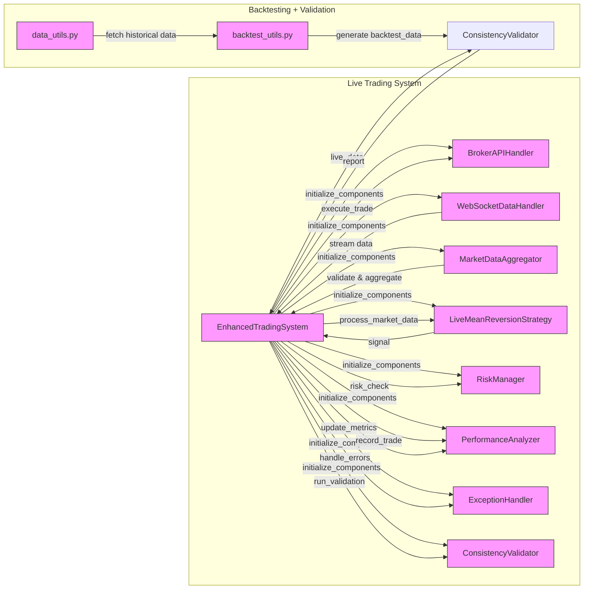

# Python Algorithmic Trading Framework

This project is a Python-based framework designed to help you build, test, and run algorithmic trading strategies. It provides tools for handling market data, managing risks, analyzing performance, and connecting to a (paper) trading account, primarily using the Alpaca API.

## What Can You Do With This?

* **Develop Trading Strategies:** Create your own automated trading rules. Examples included:

  * EMA Crossover (Trend Following)

  * Z-Score Mean Reversion

* Custom Ratio Strategy

* **Back-test Strategies:** Test your strategies on historical market data to see how they would have performed.

* **Optimize Parameters:** Find the best settings for your strategy's indicators.

* **Live/Paper Trading:** Connect to Alpaca (a brokerage API) to run your strategies with real-time data (using a paper trading account is highly recommended for testing).

* **Manage Data:** Fetch historical data, add technical indicators (like Moving Averages, ADX), and even apply data smoothing techniques (like Kalman Filter).

* **Control Risk:** Implement basic risk management rules.

* **Analyze Performance:** Get detailed reports on how well your strategies are doing (e.g., profits, losses, Sharpe Ratio, Drawdown).

* **Handle Errors:** The system has built-in error handling to make it more robust.

* **Check Consistency:** Compare how your strategy performs in back-testing versus live (paper) trading.

## Key Features

* **Strategy Library:** Includes several common trading strategy types.

* **Backtesting Engine:** Uses the popular `backtrader` library.

* **Alpaca API Integration:** For fetching data, placing orders, and managing your (paper) account.

* **Real-time Data:** Uses WebSockets to get live market data from Alpaca.

* **Data Processing:** Tools to clean, resample, and add technical indicators to data.

* **Risk Management Module:** Basic tools to assess and manage trading risks.

* **Performance Analytics:** Detailed metrics and charts to evaluate strategy performance.

* **Robust Error Handling:** Mechanisms to catch and manage common trading system errors.

## Core Modules (What Each File Does)

* `main.py`: The main script to run back-tests and strategy optimizations.

* `strategies.py`: Contains the definitions for different trading strategies (e.g., EMA Crossover, Z-Score).

* `data_utils.py`: Functions for fetching, caching, and processing market data (e.g., adding indicators).

* `backtest_utils.py`: Helper functions to analyze the results from back-testing.

* `broker_handler.py`: Manages communication with the Alpaca trading API (placing orders, getting account info).

* `live_trader.py`: Contains the logic for running strategies in a live (paper) trading environment.

* `websocket_handler.py`: Handles real-time market data streams from Alpaca via WebSockets.

* `risk_manager.py`: Implements risk management rules and calculations (like VaR).

* `performance_analyzer.py`: Calculates and reports on trading performance metrics.

* `exception_handler.py`: Provides a system for managing errors and exceptions gracefully.

* `consistency_validator.py`: Tools to compare back-test results with live trading performance.

* `test_broker_api.py`: Script to test the connection and basic functions of the Alpaca API.

## Setup

1. **Prerequisites:**

    * Python (version 3.10 or as specified in `environment.yml`)

    * Conda (recommended for managing environments)

2. **Clone the Repository:**

    ```bash
    git clone <your-repository-url>
    cd <your-repository-folder>
    ```

3. **Create Conda Environment:**

    ```bash
    conda env create -f environment.yml
    conda activate cqf-algo-trading
    ```

4. **API Keys (Alpaca):**

    * You'll need API keys from Alpaca (you can get these for free for paper trading).

    * Create a file named `.env` in the root project directory.

    * Add your Alpaca API keys to this `.env` file like this:

        ```text
        APCA_API_KEY_ID="YOUR_PAPER_API_KEY_ID"
        APCA_API_SECRET_KEY="YOUR_PAPER_API_SECRET_KEY"
        ALPACA_BASE_URL="https://paper-api.alpaca.markets" # For paper trading
        ```

    * **Important:** Make sure the `.env` file is listed in your `.gitignore` file to avoid accidentally committing your secret keys!

## How to Run

* **Run Back-tests & Optimizations:**

    ```bash
    python main.py
    ```

    This will run the predefined backtests and optimizations found in `main.py`. You can modify this file to test different strategies or parameters.

* **Run Live (Paper) Trader:**

    ```bash
    python live_trader.py
    ```

    This will start the live trading bot. It's set up for **paper trading** by default.
    **WARNING:** Be very careful if you decide to switch to live money trading. Understand the risks involved.

* **Test Alpaca API Connection:**

    ```bash
    python test_broker_api.py
    ```

    This script helps verify that your Alpaca API keys are working and you can connect to their services.

## Technologies Used

* Python

* Backtrader (for backtesting)

* Pandas, NumPy (for data manipulation)

* Alpaca Trade API (for brokerage interaction)

* Pandas TA (for technical indicators)

* Websockets (for real-time data)

* Matplotlib, Seaborn (for plotting)

## Disclaimer

This project is for educational and research purposes only. Trading financial markets involves substantial risk of loss and is not suitable for every investor. The authors and contributors are not responsible for any financial losses incurred by using this software. Always use paper trading accounts for testing and understand the risks before trading with real money.


```mermaid
flowchart LR
  %% ----- Live Trading Flow -----
  subgraph Live_Trading["Live Trading System"]
    direction TB

    ETS[EnhancedTradingSystem]
    Broker[BrokerAPIHandler]
    WS[WebSocketDataHandler]
    Agg[MarketDataAggregator]
    Strat[LiveMeanReversionStrategy]
    Risk[RiskManager]
    Perf[PerformanceAnalyzer]
    Exc[ExceptionHandler]
    Cons[ConsistencyValidator]

    ETS -->|initialize_components| Broker
    ETS -->|initialize_components| WS
    ETS -->|initialize_components| Agg
    ETS -->|initialize_components| Strat
    ETS -->|initialize_components| Risk
    ETS -->|initialize_components| Perf
    ETS -->|initialize_components| Exc
    ETS -->|initialize_components| Cons

    WS -->|stream data| ETS
    Agg -->|validate & aggregate| ETS
    ETS -->|process_market_data| Strat
    Strat -->|signal| ETS
    ETS -->|risk_check| Risk
    ETS -->|execute_trade| Broker
    ETS -->|record_trade| Perf
    ETS -->|update_metrics| Perf
    ETS -->|handle_errors| Exc
    ETS -->|run_validation| Cons
  end

  %% ----- Backtesting & Validation -----
  subgraph Backtest_and_Validation["Backtesting + Validation"]
    direction TB

    BT_Utils[backtest_utils.py]
    Data_Utils[data_utils.py]
    Cons_Val[ConsistencyValidator]

    BT_Utils -->|generate backtest_data| Cons_Val
    Data_Utils -->|fetch historical data| BT_Utils
    ETS -->|live_data| Cons_Val
    Cons_Val -->|report| ETS
  end

  %% ----- Annotations -----
  classDef core fill:#f9f,stroke:#333,stroke-width:1px;
  class ETS,Broker,WS,Agg,Strat,Risk,Perf,Exc,Cons,BT_Utils,Data_Utils core;

  %% ----- Legend -----
  click Live_Trading "https://mermaid-js.github.io/mermaid-live-editor/" "Live Trading Group"
  click Backtest_and_Validation "https://mermaid-js.github.io/mermaid-live-editor/" "Backtest & Validation Group"
```
