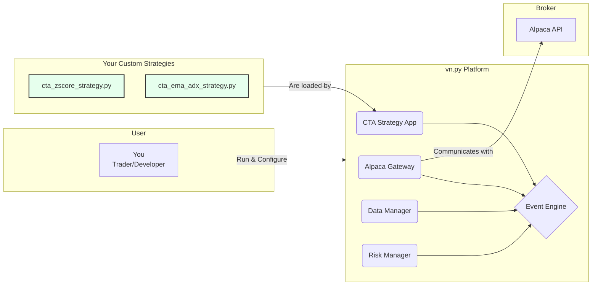

# VN.py Trading Framework

基于 VN.py 的量化交易框架，提供完整的策略开发、回测和实盘交易解决方案。

## 项目特点

- 🚀 **专业级交易框架**: 基于成熟的 VN.py 框架构建
- 📈 **多策略支持**: 内置趋势跟踪、均值回归、自定义比率等策略
- 🔄 **完整工作流**: 从策略开发到回测再到实盘交易的完整流程
- 🛡️ **风险控制**: 内置多层风险管理机制
- 🎯 **多市场支持**: 支持股票、期货、数字货币等多个市场
- 📊 **实时监控**: 提供实时性能监控和异常处理

## Why vn.py?

By building upon the `vn.py` platform, we gain several key advantages:

* **Production-Grade Stability:** Leverages a mature, industry-tested event-driven engine suitable for live trading.
* **Unified Brokerage Access:** Connects to a wide range of domestic and international brokers (including Alpaca for paper/live trading) through a unified gateway interface.
* **Integrated Toolkit:** Provides an "all-in-one" solution with built-in modules for backtesting, risk management, data management, and a graphical user interface (GUI).
* **Focus on Strategy:** Frees the developer from handling low-level details like WebSocket connections, order management, and API quirks, allowing for a pure focus on strategy logic.

## A Note on "CTA Strategy" for Stock Trading
You will notice that vn.py refers to its primary single-asset strategy module as CTA Strategy (Commodity Trading Advisor). While historically associated with futures, in the context of vn.py, this module serves as a universal engine for any strategy based on sequential bar (K-line) data. It is the standard and correct module for implementing technical analysis-based strategies for stocks, as well as for futures and cryptocurrencies.

Think of "CTA Strategy" simply as "Single-Symbol, Bar-Based Algorithmic Strategy".

## Core Strategies Implemented

To be implemented

## Platform Architecture

This project operates as a set of plugins for the `vn.py` ecosystem. The core components of `vn.py` handle all the heavy lifting.


```mermaid
flowchart LR
    subgraph User
        direction TB
        A[You<br>Trader/Developer]
    end

    subgraph vn_py_Platform ["vn.py Platform"]
        direction LR
        B(CTA Strategy App) --> C{Event Engine};
        D(Alpaca Gateway) --> C;
        E(Data Manager) --> C;
        F(Risk Manager) --> C;
    end
    
    subgraph Your_Code [Your Custom Strategies]
        G[cta_zscore_strategy.py]
        H[cta_ema_adx_strategy.py]
    end

    subgraph Broker
        I[Alpaca API]
    end

    A -- "Run & Configure" --> vn_py_Platform;
    Your_Code -- "Are loaded by" --> B;
    D -- "Communicates with" --> I;
    
    classDef yourcode fill:#e6ffed,stroke:#333,stroke-width:2px;
    class G,H yourcode
```

## Setup and Installation

1. **Prerequisites:**
    * Python (version 3.10 or higher)
    * Conda (highly recommended for environment management)

2. **Clone This Repository:**

    ```bash
    git clone <your-repository-url>
    cd <your-repository-folder>
    ```

3. **Install vn.py:**
    We will install the official `vn.py` package. It's recommended to do this in a clean virtual environment.

    ```bash
    # Create and activate a conda environment
    conda create -n vnpy_trading python=3.10 -y
    conda activate vnpy_trading
    
    # Install vn.py and its dependencies
    pip install vnpy
    ```

4. **Load Custom Strategies:**
    Copy the strategy files from this project's `strategies` directory into the `vn.py` strategies folder. You can find the `vn.py` folder path by running a simple python command:

    ```python
    import vnpy
    import os
    print(os.path.dirname(vnpy.__file__))
    ```

    Navigate to that directory, and place your strategy files inside the `vnpy/app/cta_strategy/strategies/` subfolder.

5. **Configure API Keys (Alpaca):**
    `vn.py` manages configuration through a central JSON file, not a `.env` file.
    * Run `vnstation` for the first time to generate default configuration files.
    * Open the configuration file located at `C:\Users\YourUser\.vntrader\vt_setting.json` (on Windows) or `~/.vntrader/vt_setting.json` (on Linux/Mac).
    * Find the section for `Alpaca` and enter your API keys:

    ```json
    {
        "api.key": "YOUR_PAPER_API_KEY_ID",
        "api.secret": "YOUR_PAPER_API_SECRET_KEY",
        "api.url": "https://paper-api.alpaca.markets",
        "name": "Alpaca"
    }
    ```

    **IMPORTANT:** Ensure `api.url` points to the paper trading endpoint for testing.

## How to Run

### 1. Back-testing

You can run back-tests using either the `vn.py` GUI or a script.

**Using the GUI (`VN Station`):**

1. Start the graphical interface:

    ```bash
    vnstation
    ```

2. In the main window, click on the CTA策略 (CTA Strategy) module.

3. Use the 数据管理 (Data Manager) tool to import historical stock data. For US stocks via Alpaca, the symbol format is TICKER.STK (e.g., SPY.STK).

4. In the CTA回测 (CTA Back-testing) tab, select your strategy, set the parameters, choose the stock symbol, and click 【开始回测】 (Start Back-testing).

5. The platform will automatically generate performance statistics and charts.

**Using a Script:**
Use the provided backtesting script to programmatically run backtests:

```bash
# Run a single strategy backtest
python scripts/run_backtest.py --strategy EmaAdxStrategy

# Run with custom parameters
python scripts/run_backtest.py --strategy ZScoreStrategy --symbol AAPL.NASDAQ --start 2023-01-01 --end 2023-12-31

# Run parameter optimization
python scripts/run_backtest.py --strategy EmaAdxStrategy --optimize

# Run batch backtesting for multiple strategies
python scripts/run_backtest.py --batch
```

The script supports various options:
- `--strategy`: Strategy name (EmaAdxStrategy, ZScoreStrategy, CustomRatioStrategy)
- `--symbol`: Trading symbol (default: SPY.NASDAQ)
- `--start`: Start date (YYYY-MM-DD format)
- `--end`: End date (YYYY-MM-DD format)
- `--optimize`: Run parameter optimization
- `--batch`: Run all strategies with predefined settings

### 2. Live (Paper) Trading

1. Start the graphical interface:

    ```bash
    vnstation
    ```

2. Open the CTA策略 (CTA Strategy) module.

3. On the left panel, click 【添加策略】 (Add Strategy). In the form, select your strategy class, assign it a unique instance name, and choose the stock symbol (e.g., AAPL.STK).

4. On the left panel, click **【添加策略】**, select your strategy class (e.g., `ZScoreStrategy`), and configure its parameters.

5. Once the strategy instance is created, select it from the list.

6. Click **【初始化】** to prepare the strategy, then **【启动】** to begin trading.

7. The GUI will display real-time logs, trades, and position updates.


## Disclaimer

This project is for educational and research purposes only. Trading financial markets involves substantial risk of loss and is not suitable for every investor. The authors and contributors are not responsible for any financial losses incurred by using this software. Always use paper trading accounts for testing and understand the risks before trading with real money.
