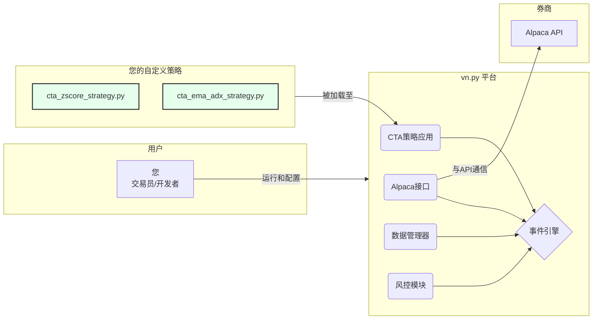

# VN.py 量化交易框架

这是一个基于知名开源项目 VN.py 构建的量化交易框架，旨在提供一套完整的策略开发、历史回测及实盘交易解决方案。

## 为何选择 vn.py？

该项目基于 vn.py 平台构建，具备以下核心优势：

* **生产级别的稳定性**：vn.py 拥有成熟且经过业界检验的事件驱动引擎，能够确保实盘交易环境的稳定可靠。

* **统一的交易接口**：通过统一的网关接口，可以无缝接入多家国内外券商及交易平台（例如，本项目中用于模拟和实盘交易的 Alpaca 平台）。

* **一体化的工具套件**：vn.py 提供“全家桶”式的解决方案，内置了回测、风控、数据管理和图形用户界面（GUI）等核心功能模块。

* **专注于策略研发**：框架处理了所有底层技术细节，例如 WebSocket 连接、订单管理和各家 API 的特性差异，让开发者可以心无旁骛地专注于策略逻辑的开发。

## 关于“CTA策略”模块的特别说明

您可能会注意到，vn.py 将其主要的单资产策略模块称为 **CTA 策略**。

尽管“CTA”（Commodity Trading Advisor，商品交易顾问）一词在历史上与期货交易紧密相关，但在 vn.py 的体系中，该模块是一个通用引擎。它适用于任何基于连续时间序列数据（K线）的算法策略。因此，使用 CTA 策略模块来开发**股票**、期货或加密货币的量化策略，都是标准且正确的选择。

您可以简单地将“CTA策略”理解为：**“基于K线（Bar）的单标的算法策略”**。

## 核心策略实现

* 技术指标 : RSI(6) + KDJ(9,3,3)
* 交易标的 : 支持TQQQ等任意标的
* 时间框架 : 1分钟K线数据
* 日内交易 : 严格不持有隔夜仓位

### 交易逻辑

做空信号 (超买反转) :

* 监控条件: RSI > 80 且 KDJ J > 100
* 入场信号: RSI下降 或 KDJ J下降
* 仓位分配: 价格≥开盘价(10%) / 价格<开盘价(30%)
* 平仓条件: RSI < 20 或 KDJ J < 0
做多信号 (超卖反转) :

* 监控条件: RSI < 20 且 KDJ J < 0
* 入场信号: RSI上升 或 KDJ J上升
* 仓位分配: 价格≥开盘价(30%) / 价格<开盘价(10%)
* 平仓条件: RSI > 80 或 KDJ J > 100

## 平台架构

本项目在 vn.py 生态中作为插件运行。所有核心的、繁重的工作都由 vn.py 的内部组件处理。


```mermaid
flowchart LR
    subgraph 用户
        direction TB
        A[您<br>交易员/开发者]
    end

    subgraph vn_py_平台 ["vn.py 平台"]
        direction LR
        B(CTA策略应用) --> C{事件引擎};
        D(Alpaca接口) --> C;
        E(数据管理器) --> C;
        F(风控模块) --> C;
    end
    
    subgraph 自定义策略 [您的自定义策略]
        G[cta_zscore_strategy.py]
        H[cta_ema_adx_strategy.py]
    end

    subgraph 券商
        I[Alpaca API]
    end

    A -- "运行和配置" --> vn_py_平台;
    自定义策略 -- "被加载至" --> B;
    D -- "与API通信" --> I;
    
    classDef yourcode fill:#e6ffed,stroke:#333,stroke-width:2px;
    class G,H yourcode
```

## 环境配置与安装

1. **环境要求**：
    * Python (3.10或更高版本)
    * Conda (强烈推荐，用于管理Python环境)

2. **克隆本代码库**：

    ```bash
    git clone <your-repository-url>
    cd <your-repository-folder>
    ```

3. **安装 vn.py**：
    我们将在一个独立的虚拟环境中安装官方的 `vn.py` 包，这是推荐的最佳实践。

    ```bash
    # 创建并激活 conda 虚拟环境
    conda create -n vnpy_trading python=3.10 -y
    conda activate vnpy_trading
    
    # 安装 vn.py 及其依赖项
    pip install vnpy
    ```

4. **加载自定义策略**：
    您需要将本项目的策略文件复制到 `vn.py` 的策略文件夹中。要找到 `vn.py` 的安装路径，可以运行以下Python命令：

    ```python
    import vnpy
    import os
    print(os.path.dirname(vnpy.__file__))
    ```

    然后，将本项目 `strategies` 目录下的策略文件复制到上述路径中的 `vnpy/app/cta_strategy/strategies/` 子目录内。

5. **配置 API 密钥 (Alpaca)**：
    `vn.py` 通过一个中心的JSON文件来管理配置，而非 `.env` 文件。
    * 首次运行 `vnstation` 后，系统会自动在用户目录下生成默认的配置文件。
    * 打开该配置文件。在 Windows 系统中，路径通常是 `C:\Users\YourUser\.vntrader\vt_setting.json`；在 Linux 或 macOS 系统中，路径是 `~/.vntrader/vt_setting.json`。
    * 找到 `Alpaca` 相关的配置部分，填入您的 API 密钥：

    ```json
    {
        "api.key": "您的模拟盘API Key",
        "api.secret": "您的模拟盘API Secret",
        "api.url": "https://paper-api.alpaca.markets",
        "name": "Alpaca"
    }
    ```

    **重要提示**：为安全起见，在测试阶段请确保 `api.url` 指向的是 Alpaca 的**模拟盘**交易地址。

## 如何运行

### 1. 策略回测

您可以通过 `vn.py` 的图形化界面或我们提供的脚本来运行回测。

**使用图形化界面 (`VN Station`)**：

1. 在命令行启动图形化界面：

    ```bash
    vnstation
    ```

2. 在主窗口中，点击加载 **CTA策略** 模块。

3. 使用 **数据管理** 工具导入您需要的股票历史数据。请注意，通过 Alpaca 接口获取美股数据时，合约代码的格式为“股票代码.STK”，例如“SPY.STK”。

4. 切换到 **CTA回测** 界面，选择您的策略、设置参数、选定股票代码，然后点击 **【开始回测】** 按钮。

5. 平台将自动完成回测，并生成详细的业绩统计和图表。

**使用脚本**：
您也可以使用我们提供的脚本来自动执行回测：

```bash
# 运行单个策略回测
python scripts/run_backtest.py --strategy EmaAdxStrategy

# 使用自定义参数运行回测
python scripts/run_backtest.py --strategy ZScoreStrategy --symbol AAPL.NASDAQ --start 2023-01-01 --end 2023-12-31

# 运行参数优化
python scripts/run_backtest.py --strategy EmaAdxStrategy --optimize

# 批量回测多个策略
python scripts/run_backtest.py --batch
```

该脚本支持多种命令行参数：

* `--strategy`：策略名称 (EmaAdxStrategy, ZScoreStrategy, CustomRatioStrategy)
* `--symbol`：交易标的 (默认为 SPY.NASDAQ)
* `--start`：回测开始日期 (格式: YYYY-MM-DD)
* `--end`：回测结束日期 (格式: YYYY-MM-DD)
* `--optimize`：执行参数优化
* `--batch`：批量运行所有预设策略

### 2. 实盘（模拟）交易

1. 启动图形化界面：

    ```bash
    vnstation
    ```

2. 打开 **CTA策略** 模块。

3. 在左侧的策略管理面板，点击 **【添加策略】**。在弹出的窗口中，选择您的策略类（如 `ZScoreStrategy`），为其实例指定一个唯一的名称，并配置好交易参数和股票代码（如 AAPL.STK）。

4. 创建成功后，新的策略实例会出现在列表中。选中它。

5. 依次点击 **【初始化】** 和 **【启动】** 按钮。

6. 策略启动后，您可以在图形化界面的日志、委托、成交和持仓等窗口中实时监控策略的运行状态。

## 项目文件结构

```text
.
├── strategies/
│   ├── cta_zscore_strategy.py        # Z-Score均值回归策略
│   ├── cta_ema_adx_strategy.py       # EMA金叉死叉结合ADX过滤策略
│   └── cta_custom_ratio_strategy.py  # 自定义价格比率策略
├── scripts/
│   ├── run_backtest.py               # 回测及优化脚本
│   ├── run_live_trading.py           # 实盘/模拟盘运行脚本
│   ├── download_data.py              # 历史数据下载工具
│   ├── install.py                    # 框架安装脚本
│   ├── test_framework.py             # 框架测试与验证脚本
│   └── quick_start.py                # 快速入门演示脚本
├── config/
│   ├── backtest_config.json          # 回测配置文件
│   └── live_trading_config.json      # 实盘交易配置文件
├── docs/
│   └── project_requirement.md        # 项目需求与规格说明
├── requirements_vnpy.txt             # VN.py 框架依赖
└── README.md
```

## 免责声明

本项目仅用于教育和研究目的。金融市场交易存在重大亏损风险，不适合所有投资者。对于使用本软件可能造成的任何财务损失，项目作者及贡献者不承担任何责任。在投入真实资金前，请务必使用模拟账户进行充分测试，并完全理解所有相关风险。
